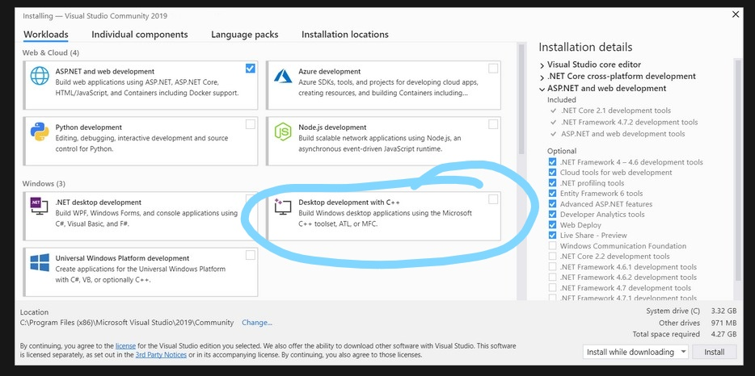
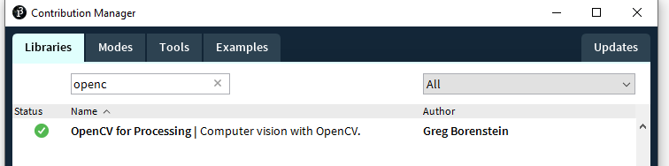

# VSSS simulator

## Requirements for Box2D C++ Engine
- [CMAKE](https://cmake.org/)
- [Visual Studio 2019](https://docs.microsoft.com/en-us/cpp/build/vscpp-step-0-installation?view=msvc-160)
    - With Desktop Development with C++
    - 

## Requirements for Processing Server
- [Processing 3.5.4](https://processing.org/download/)
    - With opencv Library
    - 

## Requirements for Python Clients
- [Python >3.8.X](https://www.python.org/downloads/)
- [Jupyter](https://pypi.org/project/jupyter/):
    ```sh
        $ pip install jupyter
    ```

## Recommended Environment for development
- [VS CODE](https://code.visualstudio.com/)
    - With [Python](https://marketplace.visualstudio.com/items?itemName=ms-python.python) extention:
    - With [Jupyter](https://marketplace.visualstudio.com/items?itemName=ms-toolsai.jupyter)
